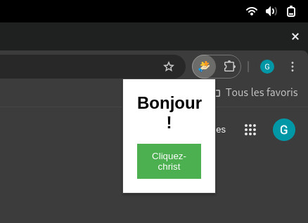
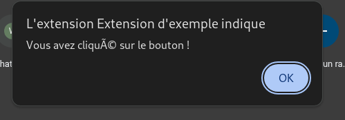

# 🚀 Chrome Extension - Suspicious Site Protection

This Chrome extension is designed to detect potentially suspicious websites and display an alert to warn users about possible risks.

---

## 🛠️ Features
- **Automatic Detection**: Identifies suspicious websites using a predefined list.
- **Visual Alert**: Displays a clear banner to notify users of potential dangers.
- **Customizable Dismissal**: Allows users to close the alert if desired.
- **Clean Design**: Modern and responsive interface for optimal usability.

---

## 🎯 Objective
Our goal is to enhance user safety by providing immediate alerts when visiting potentially harmful or fraudulent websites.

---

## 📂 Project Structure
Key files in the project:

- `manifest.json`: Configures the Chrome extension settings.
- `background.js`: Monitors web navigation and flags suspicious sites.
- `content.js`: Injects the alert into the webpage when a flagged site is detected.
- `styles.css`: Defines the styling of the alert banner.
- `icon.png`: Icon used for the extension in the Chrome toolbar.

---

## 🚀 Installation
### Step 1: Clone the Repository
```bash
git clone https://github.com/christh2/Createk_extension.git
cd extension-anti-phishing
```

### Step 2: Load the Extension in Chrome
1. Open `chrome://extensions/` in your Chrome browser.
2. Enable **Developer Mode** (toggle in the top right corner).
3. Click **Load unpacked extension**.
4. Select the project folder.

---

## 🌟 Contributing
We welcome contributions! Here's how you can help:
1. Fork the repository.
2. Create a new branch (`git checkout -b feature-name`).
3. Make your changes and commit them (`git commit -m 'Add feature'`).
4. Push your changes (`git push origin feature-name`).
5. Open a Pull Request.

---

## 🛡️ Future Enhancements
- **User Customization**: Add the ability for users to define their own list of suspicious websites.
- **Notification System**: Integrate a notification feature for newly flagged risks.
- **Settings Storage**: Use `chrome.storage` to save user preferences.

---

## 📄 License
This project is licensed under the [MIT License](LICENSE). Feel free to use, modify, and distribute it as needed.

---

## 👤 Author
Created by **[Tek3 students (Phisher)](https://github.com/christh2/Createk_extension.git)**.

---

## 📸 Preview
### Alert Banner Example


